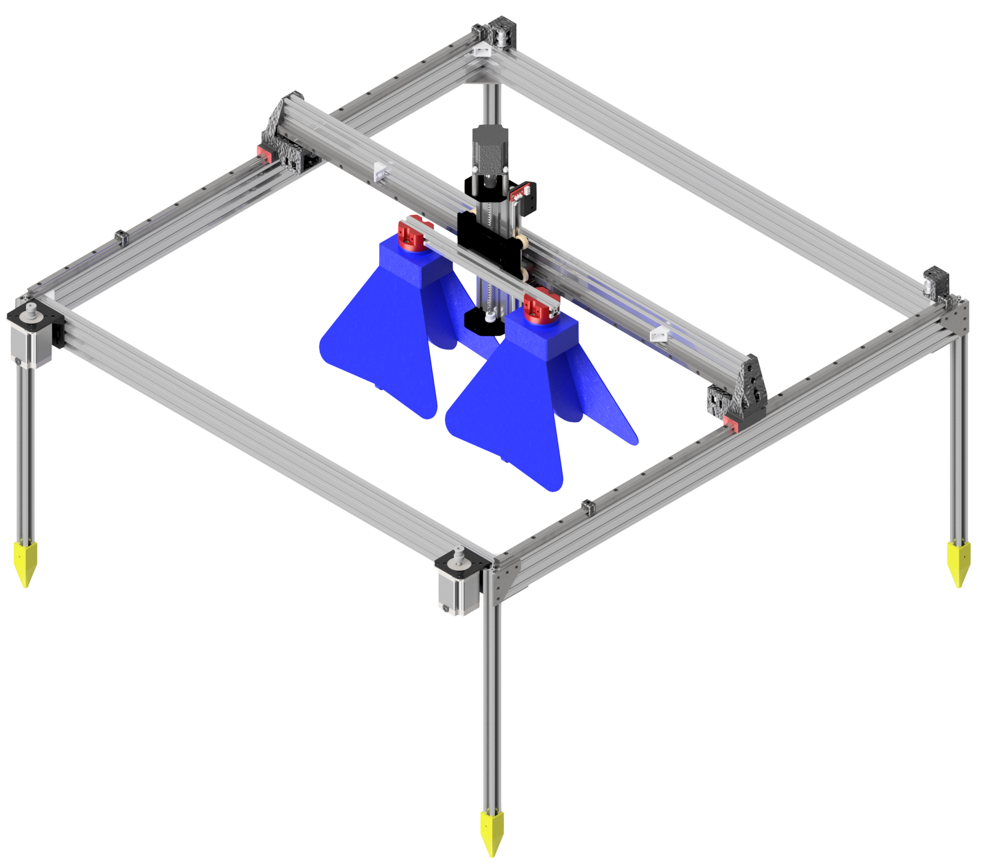

# Archivos CAD - GPR Portable

Este repositorio contiene los archivos CAD necesarios para la construcción del GPR portátil desarrollado en el proyecto de Desminado Humanitario de la Universidad de los Andes.

## Proyecto Desminado Humanitario

El GPR portátil es un radar de penetración terrestre diseñado para la detección de minas terrestres en exteriores. Este equipo es uno de los desarrollos principales del laboratorio de Desminado Humanitario, complementando las capacidades del GPR de laboratorio fijo y permitiendo la toma de muestras en campo abierto.

## Contenido del repositorio

En este repositorio encontrarás:

* Archivos CAD de las piezas individuales del GPR portátil.
* Ensambles completos del GPR portátil.
* Documentación breve de los archivos CAD, incluyendo las especificaciones técnicas y materiales recomendados para cada pieza.

## Requisitos de uso

Para visualizar y modificar los archivos CAD de este repositorio, es necesario contar con software compatible con los formatos incluidos, como:

* Autodesk Inventor
* Autodesk Fusion 360

Además, en el caso de modificación de las piezas, asegurarse de que los ensamblajes sean mantenidos en las proporciones y especificaciones indicadas en la documentación.

## Información Adicional

Este repositorio es parte del proyecto de Desminado Humanitario de la Universidad de los Andes. El código y otros archivos se pueden visualizar en el [repositorio principal](https://github.com/gdh-uniandes/GPR-Uniandes)

## Grupo de Desminado Humanitario

Universidad de los Andes, Bogotá D.C, Colombia.

### Contacto:

* Correo: [desminadohumanitario@uniandes.edu.co](mailto:desminadohumanitario@uniandes.edu.co)
